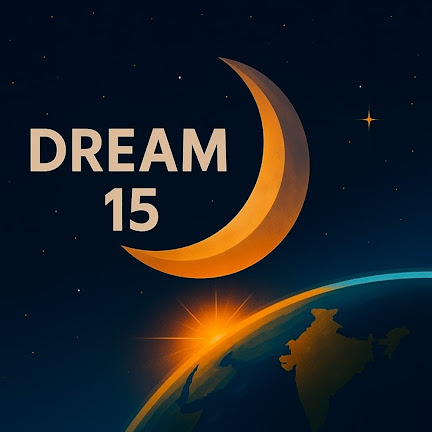
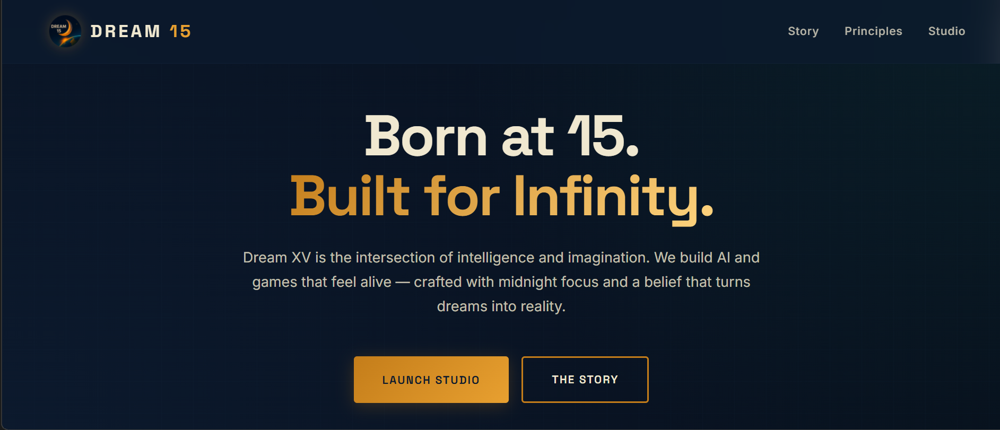

  

<h1 align="center">DreamXV AI Studio</h1>

  Universal Multi-Agent AI Creation Platform

 🚀 DreamXV AI Studio

### Universal Multi-Agent AI Creation Platform

DreamXV AI Studio is a Band-powered multi-agent platform that transforms simple ideas into complete project blueprints, documentation, assets, roadmaps, and production plans.

Instead of generating a single response, DreamXV coordinates specialized AI agents that collaborate to design, plan, validate, and package entire digital products.

---

# 🌟 Vision

Most AI tools generate content.

DreamXV AI Studio generates complete projects.

A user can enter an idea such as:

* Build a PUBG-like Battle Royale
* Create a Food Delivery App
* Design an AI Startup
* Build a SaaS CRM Platform
* Create an Educational Platform

DreamXV automatically:

* Understands the idea
* Classifies the project type
* Activates specialized agents
* Generates documentation
* Creates architecture
* Produces assets
* Builds roadmaps
* Creates task plans
* Runs QA validation
* Generates export packages

---

# 🧠 Powered By Multi-Agent Collaboration

DreamXV uses Band as the orchestration layer.

Agents collaborate through structured workflows instead of isolated prompts.

### Core Agents

* Chief Agent
* Project Manager Agent
* Research Agent
* Architecture Agent
* Design Agent
* Development Agent
* Documentation Agent
* QA Agent
* Marketing Agent
* Reviewer Agent
* Export Agent

### Specialized Agent Packs

#### 🎮 Game Development

* Story Agent
* Character Agent
* World Agent
* Gameplay Agent
* Weapon Agent
* Vehicle Agent
* Quest Agent

#### 📱 Mobile Apps

* UX Agent
* Screen Flow Agent
* Feature Agent

#### 💼 SaaS Products

* Business Agent
* Pricing Agent
* Workflow Agent

#### 🤖 AI Products

* AI Strategy Agent
* Agent Architecture Agent
* Model Agent

---

# 🏗️ Supported Project Types

DreamXV dynamically adapts based on the user's prompt.

Supported categories:

* Games
* Mobile Apps
* Web Applications
* SaaS Platforms
* AI Products
* E-commerce Platforms
* Startups
* Educational Platforms
* Automation Tools
* Custom Software

---

# 🔄 Workflow

User Prompt

↓

Intent Detection

↓

Project Classification

↓

Agent Orchestration

↓

Artifact Generation

↓

Asset Generation

↓

QA Validation

↓

Export System

---

# 📦 Generated Artifacts

Depending on project type, DreamXV can generate:

### Documentation

* Product Requirements Documents
* Game Design Documents
* Technical Design Documents
* Architecture Documents
* API Specifications
* User Stories

### Design

* Character Bibles
* World Bibles
* UI Design Guides
* Screen Specifications
* User Flows

### Planning

* Roadmaps
* Task Graphs
* Production Plans
* Risk Analysis
* QA Reports

### Business

* Market Research
* Monetization Plans
* Marketing Strategies
* Competitive Analysis

---

# 🎨 Asset Generation

DreamXV supports AI-powered asset generation.

Examples:

* Character Concepts
* Environment Concepts
* UI Screens
* Landing Pages
* Product Mockups
* Brand Concepts
* Marketing Assets

Generated assets are organized in a dedicated gallery.

---

# 📊 Dashboard Features

### Project Overview

* Project Type
* Completion Score
* Generated Artifacts
* QA Status
* Export Status

### Agent Monitoring

* Active Agents
* Execution Status
* Processing Time
* Agent Outputs

### Project Planning

* Roadmaps
* Timelines
* Gantt Charts
* Task Dependencies

---

# 🔍 Quality Assurance

DreamXV automatically validates:

* Functionality
* Design Quality
* Security
* Performance
* Scalability
* Accessibility
* Compatibility

Generated QA reports help identify weaknesses before implementation begins.

---

# 📤 Export System

Supported exports:

* JSON
* Markdown
* ZIP Packages
* Atlas-Compatible Projects

Generated packages contain:

* Documentation
* Artifacts
* Assets
* Roadmaps
* QA Reports
* Project Manifests

---

# 🏛️ Atlas Compatibility

DreamXV can generate Atlas-compatible project structures including:

* project_manifest.json
* assets_manifest.json
* documentation_manifest.json
* task_graph.json
* qa_report.json
* review_report.json

---

# 🛠️ Technology Stack

### Frontend

* HTML
* CSS
* JavaScript

### Backend

* Python
* FastAPI

### AI Orchestration

* Band

### LLM Providers

* Gemini
* OpenRouter
* OpenAI Compatible Providers

### Asset Generation

* AI/ML API
* Image Generation Services

---

# 🎯 Hackathon Goal

DreamXV AI Studio demonstrates how Band can orchestrate multiple AI agents to transform a simple idea into a complete project package.

Rather than acting as a chatbot, DreamXV functions as an AI-powered software studio capable of planning and designing entire products.

---

# 👨‍💻 Creator

**Sahir Ali (Dream XV)**

Band of Agents Hackathon Participant

Building the future of AI-powered creation tools through collaborative multi-agent systems.

---

# 🚀 Future Roadmap

* Real-time agent collaboration
* Plugin marketplace
* One-click project deployment
* Code generation pipelines
* Team collaboration features
* Advanced asset generation
* Cross-platform exports

---

## DreamXV AI Studio

**From Idea → To Complete Project Blueprint**
